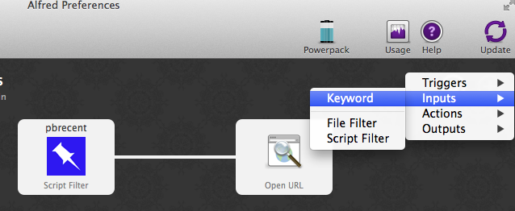
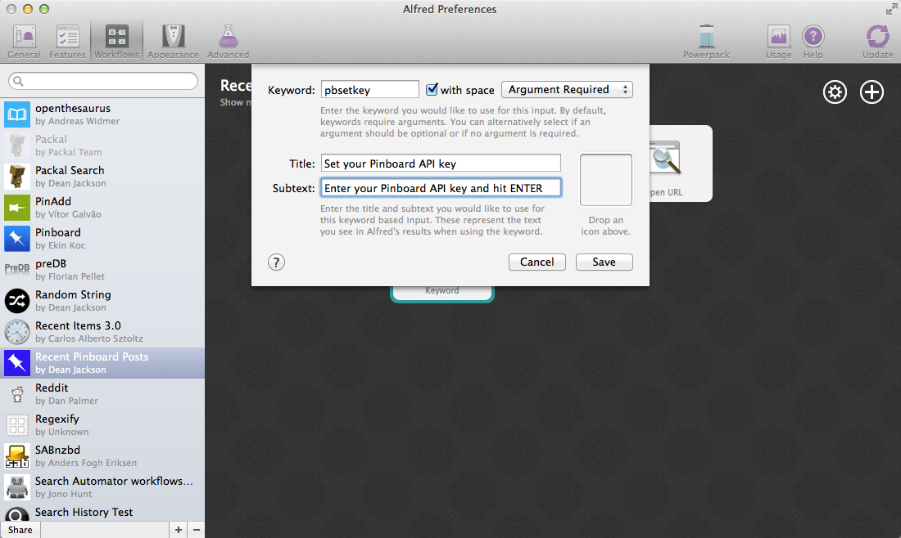

.. _tutorial2:

===================================
Writing A Pinboard Workflow, Part 2
===================================

In which we create a `Pinboard.in <https://pinboard.in/>`_ Workflow ready for
mass consumption.

In the :ref:`first part <tutorial>` of the tutorial, we built a useable Workflow
to view, search and open your recent Pinboard posts. The Workflow isn't quite
ready to be distributed to other users, however: we can't expect them to go
grubbing around in the source code like an animal to set their own API keys.

What's more, an update to the Workflow would overwrite their changes.

So now we're going to edit the Workflow so users can add their API key from the
comfort of Alfred's friendly query box and use
:attr:`Workflow.settings <workflow.workflow.Workflow.settings>`
to save it in the Workflow's data directory where it won't get overwritten.

Performing multiple actions from one script
===========================================

To set the user's API key, we're going to need a new action. We could write a
second script to do this, but we're going to stick with one script and make it
smart enough to do two things, instead. The advantage of using one script is
that if you build a workflow with lots of actions, you don't have a dozen or more
scripts to manage.

We'll start by adding an argument parser (using :mod:`argparse`) to ``main()`` and some
if-clauses to alter the script's behaviour depending on the arguments
passed to it by Alfred.

.. code-block:: python
   :linenos:
   :emphasize-lines: 4,5,8-15,39-89

    # encoding: utf-8

    import sys
    import argparse
    from workflow import Workflow, ICON_WEB, ICON_WARNING, web

    def get_recent_posts(api_key):
        """Retrieve recent posts from Pinboard.in

        Returns a list of post dictionaries.

        """
        url = 'https://api.pinboard.in/v1/posts/recent'
        params = dict(auth_token=api_key, count=100, format='json')
        r = web.get(url, params)

        # throw an error if request failed
        # Workflow will catch this and show it to the user
        r.raise_for_status()

        # Parse the JSON returned by pinboard and extract the posts
        result = r.json()
        posts = result['posts']
        return posts

    def search_key_for_post(post):
        """Generate a string search key for a post"""
        elements = []
        elements.append(post['description'])  # title of post
        elements.append(post['tags'])  # post tags
        elements.append(post['extended'])  # description
        return u' '.join(elements)

    def main(wf):

        # build argument parser to parse script args and collect their
        # values
        parser = argparse.ArgumentParser()
        # add an optional (nargs='?') --setkey argument and save its
        # value to 'apikey' (dest). This will be called from a separate "Run Script"
        # action with the API key
        parser.add_argument('--setkey', dest='apikey', nargs='?', default=None)
        # add an optional query and save it to 'query'
        parser.add_argument('query', nargs='?', default=None)
        # parse the script's arguments
        args = parser.parse_args(wf.args)

        ####################################################################
        # Save the provided API key
        ####################################################################

        # decide what to do based on arguments
        if args.apikey:  # Script was passed an API key
            # save the key
            wf.settings['api_key'] = args.apikey
            return 0  # 0 means script exited cleanly

        ####################################################################
        # Check that we have an API key saved
        ####################################################################

        api_key = wf.settings.get('api_key', None)
        if not api_key:  # API key has not yet been set
            wf.add_item('No API key set.',
                        'Please use pbsetkey to set your Pinboard API key.',
                        valid=False,
                        icon=ICON_WARNING)
            wf.send_feedback()
            return 0

        ####################################################################
        # View/filter Pinboard posts
        ####################################################################

        query = args.query
        # Retrieve posts from cache if available and no more than 600
        # seconds old

        def wrapper():
            """`cached_data` can only take a bare callable (no args),
            so we need to wrap callables needing arguments in a function
            that needs none.
            """
            return get_recent_posts(api_key)

        posts = wf.cached_data('posts', wrapper, max_age=600)

        # If script was passed a query, use it to filter posts
        if query:
            posts = wf.filter(query, posts, key=search_key_for_post, min_score=20)

        # Loop through the returned posts and add a item for each to
        # the list of results for Alfred
        for post in posts:
            wf.add_item(title=post['description'],
                        subtitle=post['href'],
                        arg=post['href'],
                        valid=True,
                        icon=ICON_WEB)

        # Send the results to Alfred as XML
        wf.send_feedback()
        return 0

    if __name__ == u"__main__":
        wf = Workflow()
        sys.exit(wf.run(main))

Quite a lot has happened here: at the top in line 5, we're importing a couple
more icons that we use in ``main()`` to notify the user that their API key is
missing and that they should set it (lines 65–72).

(You can see a list of all supported icons :ref:`here <icon-list>`.)

We've adapted ``get_recent_posts()`` to accept an ``api_key`` argument. We *could*
continue to use the ``API_KEY`` global variable, but that'd be bad form.

As a result of this, we've had to alter the way
:meth:`Workflow.cached_data() <workflow.workflow.Workflow.cached_data>` is called.
It can't call a function that requires any arguments, so we've added a
``wrapper()`` function within ``main()`` (lines 82–87)
that calls ``get_recent_posts()`` with the necessary ``api_key`` arguments, and
we pass this ``wrapper()`` function (which needs no arguments) to
:meth:`Workflow.cached_data() <workflow.workflow.Workflow.cached_data>` instead
(line 89).

At the top of ``main()`` (lines 39–49), we've added an argument parser using
:mod:`argparse` that can take an optional ``--apikey APIKEY`` argument
and an optional ``query`` argument (remember the script doesn't require a query).

Then, in lines 55–59, we check if an API key was passed using ``--apikey``.
If it was, we save it using :attr:`~workflow.workflow.Workflow.settings`
(see `below <settings>`).

Once this is done, we exit the script.

If no API key was specified with ``--apikey``, we try to show/filter Pinboard
posts as before. But first of all, we now have to check to see if we already
have an API key saved (lines 65–72). If not, we show the user a warning
(No API key set) and exit the script.

Finally, if we have an API key saved, we retrieve it and show/filter the Pinboard
posts just as before (lines 78–107).

Of course, we don't have an API key saved, and we haven't yet set up our Workflow
in Alfred to save one, so the Workflow currently won't work. Try to run it,
and you'll see the warning we just implemented:

.. image:: _static/screen15_no_api_key.png

So let's add that functionality now.

Multi-step actions
==================

Asking the user for input and saving it is best done in two steps:

1. Ask for the data.
2. Pass it to a second action to save it.

A Script Filter is designed to be called constantly by Alfred and return results.
This time, we just want to get some data, so we'll use a **Keyword** input instead.

Go back to your Workflow in Alfred's Preferences and add a **Keyword** input:

And set it up as follows (we'll use the keyword ``pbsetkey`` because that's what we told the user to use
in the above warning message):

You can now enter ``pbsetkey`` in Alfred and see the following:

.. image:: _static/screen18_pbsetkey.png

It won't do anything yet, though, as we haven't connected its output to anything.

Back in Alfred's Preferences, add a **Run Script** action:

.. image:: _static/screen19_runscript.png

and point it at our ``pinboard.py`` script with the ``--setkey`` argument:

.. image:: _static/screen20_runscript_settings.png

Finally, connect the ``pbsetkey`` **Keyword** to the new **Run Script** action:

.. image:: _static/screen21_connection.png

Now you can call ``pbsetkey`` in Alfred, paste in your Pinboard API key and hit
**ENTER**. It will be saved by the Workflow and ``pbrecent`` will once again
work as expected. Try it.

It's a little confusing receiving no feedback on whether the key was saved or not,
so go back into Alfred's Preferences, and add an **Output > Post Notification**
action to your Workflow:

.. image:: _static/screen22_add_notification.png

In the resulting pop-up, enter a message to be shown in Notification Center:

.. image:: _static/screen22_notification_settings.png

and connect the **Run Script** we just added to it:

.. image:: _static/screen23_three_way.png

Try setting your API key again with ``pbsetkey`` and this time you'll get a
notification that it was saved.

.. _settings:

Saving settings
===============

Saving the API key was pretty easy (1 line of code). :class:`~workflow.workflow.Settings`
is a special dictionary that automatically saves itself when you change its
contents. It can be used much like a normal dictionary with the caveat that all
values must be serializable to JSON as the settings are saved as a JSON file in
the Workflow's data directory.

Very simple, yes, but secure? No. A better place to save the API key would be
in the user's Keychain. Let's do that.

.. _secure-settings:

Saving settings securely
------------------------

:class:`~workflow.workflow.Workflow` provides three methods for managing data
saved in OS X's Keychain: :meth:`~workflow.workflow.Workflow.get_password`,
:meth:`~workflow.workflow.Workflow.save_password` and :meth:`~workflow.workflow.Workflow.delete_password`.

They are all called with an ``account`` name and an optional ``service`` name
(by default, this is your Workflow's ``bundle ID``).

Change your ``pinboard.py`` script as follows to use Keychain instead of a JSON
file to store your API key:

.. code-block:: python
   :linenos:
   :emphasize-lines: 5,58,65-72

    # encoding: utf-8

    import sys
    import argparse
    from workflow import Workflow, ICON_WEB, ICON_WARNING, web, PasswordNotFound

    def get_recent_posts(api_key):
        """Retrieve recent posts from Pinboard.in

        Returns a list of post dictionaries.

        """
        url = 'https://api.pinboard.in/v1/posts/recent'
        params = dict(auth_token=api_key, count=100, format='json')
        r = web.get(url, params)

        # throw an error if request failed
        # Workflow will catch this and show it to the user
        r.raise_for_status()

        # Parse the JSON returned by pinboard and extract the posts
        result = r.json()
        posts = result['posts']
        return posts

    def search_key_for_post(post):
        """Generate a string search key for a post"""
        elements = []
        elements.append(post['description'])  # title of post
        elements.append(post['tags'])  # post tags
        elements.append(post['extended'])  # description
        return u' '.join(elements)

    def main(wf):

        # build argument parser to parse script args and collect their
        # values
        parser = argparse.ArgumentParser()
        # add an optional (nargs='?') --apikey argument and save its
        # value to 'apikey' (dest). This will be called from a separate "Run Script"
        # action with the API key
        parser.add_argument('--setkey', dest='apikey', nargs='?', default=None)
        # add an optional query and save it to 'query'
        parser.add_argument('query', nargs='?', default=None)
        # parse the script's arguments
        args = parser.parse_args(wf.args)

        ####################################################################
        # Save the provided API key
        ####################################################################

        # decide what to do based on arguments
        if args.apikey:  # Script was passed an API key
            # save the key
            wf.save_password('pinboard_api_key', args.apikey)
            return 0  # 0 means script exited cleanly

        ####################################################################
        # Check that we have an API key saved
        ####################################################################

        try:
            api_key = wf.get_password('pinboard_api_key')
        except PasswordNotFound:  # API key has not yet been set
            wf.add_item('No API key set.',
                        'Please use pbsetkey to set your Pinboard API key.',
                        valid=False,
                        icon=ICON_WARNING)
            wf.send_feedback()
            return 0

        ####################################################################
        # View/filter Pinboard posts
        ####################################################################

        query = args.query
        # Retrieve posts from cache if available and no more than 600
        # seconds old

        def wrapper():
            """`cached_data` can only take a bare callable (no args),
            so we need to wrap callables needing arguments in a function
            that needs none.
            """
            return get_recent_posts(api_key)

        posts = wf.cached_data('posts', wrapper, max_age=600)

        # If script was passed a query, use it to filter posts
        if query:
            posts = wf.filter(query, posts, key=search_key_for_post, min_score=20)

        # Loop through the returned posts and add an item for each to
        # the list of results for Alfred
        for post in posts:
            wf.add_item(title=post['description'],
                        subtitle=post['href'],
                        arg=post['href'],
                        valid=True,
                        icon=ICON_WEB)

        # Send the results to Alfred as XML
        wf.send_feedback()
        return 0

    if __name__ == u"__main__":
        wf = Workflow()
        sys.exit(wf.run(main))

:meth:`~workflow.workflow.Workflow.get_password` raises a
:class:`~workflow.workflow.PasswordNotFound` exception if the requested
password isn't in your Keychain, so we import :class:`~workflow.workflow.PasswordNotFound`
and change ``if not api_key:`` to a ``try ... except`` clause (lines 65–72).

Try running your Workflow again. It will complain that you haven't saved your
API key (it's looking in Keychain now, not the settings), so set your API key
once again, and you should be able to browse your recent posts in Alfred once more.

And if you open **Keychain Access**, you'll find the API key safely tucked away
in your Keychain:

.. image:: _static/screen24_keychain.png

As a bonus, if you have multiple Macs and use iCloud Keychain, the API key will
be seamlessly synced across machines, saving you the trouble of setting up the
Workflow multiple times.

"Magic" arguments
=================

Now that the API key is stored in Keychain, we don't need it saved in the
Workflow's settings any more (and having it there that kind of defeats the
purpose of using Keychain). To get rid of it, we can use one of **Alfred-Workflow**'s
"magic" arguments: ``workflow:delsettings``.

Open up Alfred, and enter ``pbrecent workflow:delsettings``. You should see the
following message:

.. image:: _static/screen25_magic.png

**Alfred-Workflow** has recognised one of its "magic" arguments, performed
the corresponding action, logged it to the log file, notified the user via
Alfred and exited the Workflow.

Magic arguments are designed to help coders develop and debug Workflows.

See :ref:`magic-arguments` for more details.

Logging
=======

There's a log, you say? Yup. There's a :class:`logging.Logger`
instance at :attr:`Workflow.logger <workflow.workflow.Workflow.logger>`
configured to output to both the Terminal (in case you're running your Workflow
script in Terminal) and your Workflow's log file. Normally, I use it like this:

.. code-block:: python
   :linenos:

    from workflow import Workflow

    log = None

    def main(wf):
        log.debug('Started')

    if __name__ == '__main__':
        wf = Workflow()
        log = wf.logger
        wf.run(main)

Assigning :attr:`Workflow.logger <workflow.workflow.Workflow.logger>` to the
module-global ``log`` means it can be accessed from within any function
without having to pass the :class:`~workflow.workflow.Workflow` or
:attr:`Workflow.logger <workflow.workflow.Workflow.logger>` instance around.

Spit and polish
===============

So far, the Workflow's looking pretty good. But there are still a few of things
that could be better. For one, it's not necessarily obvious to a user where to
find their Pinboard API key (it took me a good, hard Googling to find it while
writing these tutorials). For another, it can be confusing if there are no results
from a Workflow and Alfred shows its default Google/Amazon searches instead.
Finally, the Workflow is unresponsive while updating
the list of recent posts from Pinboard. That can't be helped if we don't have any
posts cached, but apart from the very first run, we always will, so why don't
we show what we have and update in the background?

Let's fix those issues. The easy ones first.

Two actions, one keyword
------------------------

To solve the first issue (Pinboard API keys being hard to find), we'll add a second
**Keyword** input that responds to the same ``pbsetkey`` keyword as our other
action, but this one will just send the user to the Pinboard
`password settings page <https://pinboard.in/settings/password>`_ where the API
keys are kept.

Go back to your Workflow in Alfred's Preferences and add a new **Keyword** with
the following settings:

.. image:: _static/screen26_keyword2.png

Now when you type ``pbsetkey`` into Alfred, you should see two options:

.. image:: _static/screen27_1_keyword_2_actions.png

The second action doesn't do anything yet, of course, because we haven't connected
it to anything. So add an **Open URL** action in Alfred, enter this URL:

https://pinboard.in/settings/password

and leave all the settings at their defaults.

.. image:: _static/screen28_open_url.png

Finally, connect your new **Keyword** to the new **Open URL** action:

.. image:: _static/screen29_link.png

Enter ``pbsetkey`` into Alfred once more and try out the new action. Pinboard
should open in your default browser.

Easy peasy.

.. _no-results-warning:

Notifying the user if there are no results
------------------------------------------

Alfred's default behaviour when a Script Filter returns no results is to show
its fallback searches. This is also what it does if a Workflow crashes. So,
the best thing to do when a user is explicitly using your Workflow is to
show a message indicating that no results were found.

Change ``pinboard.py`` to the following:

.. code-block:: python
   :linenos:
   :emphasize-lines: 96-99

    # encoding: utf-8

    import sys
    import argparse
    from workflow import Workflow, ICON_WEB, ICON_WARNING, web, PasswordNotFound

    def get_recent_posts(api_key):
        """Retrieve recent posts from Pinboard.in

        Returns a list of post dictionaries.

        """
        url = 'https://api.pinboard.in/v1/posts/recent'
        params = dict(auth_token=api_key, count=100, format='json')
        r = web.get(url, params)

        # throw an error if request failed
        # Workflow will catch this and show it to the user
        r.raise_for_status()

        # Parse the JSON returned by pinboard and extract the posts
        result = r.json()
        posts = result['posts']
        return posts

    def search_key_for_post(post):
        """Generate a string search key for a post"""
        elements = []
        elements.append(post['description'])  # title of post
        elements.append(post['tags'])  # post tags
        elements.append(post['extended'])  # description
        return u' '.join(elements)

    def main(wf):

        # build argument parser to parse script args and collect their
        # values
        parser = argparse.ArgumentParser()
        # add an optional (nargs='?') --apikey argument and save its
        # value to 'apikey' (dest). This will be called from a separate "Run Script"
        # action with the API key
        parser.add_argument('--setkey', dest='apikey', nargs='?', default=None)
        # add an optional query and save it to 'query'
        parser.add_argument('query', nargs='?', default=None)
        # parse the script's arguments
        args = parser.parse_args(wf.args)

        ####################################################################
        # Save the provided API key
        ####################################################################

        # decide what to do based on arguments
        if args.apikey:  # Script was passed an API key
            # save the key
            wf.save_password('pinboard_api_key', args.apikey)
            return 0  # 0 means script exited cleanly

        ####################################################################
        # Check that we have an API key saved
        ####################################################################

        try:
            api_key = wf.get_password('pinboard_api_key')
        except PasswordNotFound:  # API key has not yet been set
            wf.add_item('No API key set.',
                        'Please use pbsetkey to set your Pinboard API key.',
                        valid=False,
                        icon=ICON_WARNING)
            wf.send_feedback()
            return 0

        ####################################################################
        # View/filter Pinboard posts
        ####################################################################

        query = args.query
        # Retrieve posts from cache if available and no more than 600
        # seconds old

        def wrapper():
            """`cached_data` can only take a bare callable (no args),
            so we need to wrap callables needing arguments in a function
            that needs none.
            """
            return get_recent_posts(api_key)

        posts = wf.cached_data('posts', wrapper, max_age=600)

        # If script was passed a query, use it to filter posts
        if query:
            posts = wf.filter(query, posts, key=search_key_for_post, min_score=20)

        if not posts:  # we have no data to show, so show a warning and stop
            wf.add_item('No posts found', icon=ICON_WARNING)
            wf.send_feedback()
            return 0

        # Loop through the returned posts and add an item for each to
        # the list of results for Alfred
        for post in posts:
            wf.add_item(title=post['description'],
                        subtitle=post['href'],
                        arg=post['href'],
                        valid=True,
                        icon=ICON_WEB)

        # Send the results to Alfred as XML
        wf.send_feedback()
        return 0

    if __name__ == u"__main__":
        wf = Workflow()
        sys.exit(wf.run(main))

In lines 96-99, we check to see it there are any posts, and if not, we show
the user a warning, send the results to Alfred and exit. This does away with
Alfred's distracting default searches and lets the user know exactly what's
going on.

.. _background-updates:

Greased lightning: background updates
-------------------------------------

All that remains is for our Workflow to provide the blazing fast results Alfred
users have come to expect. No waiting around for glacial web services for the
likes of us. As long as we have some posts saved in the cache, we can show those
while grabbing an updated list in the background (and notifying the user of
the update, of course).

Now, there are a few different ways to start a background process. We could ask the user
to set up a ``cron`` job, but ``cron`` isn't the easiest software to use. We could
add and load a `Launch Agent <http://robots.thoughtbot.com/example-writing-a-launch-agent-for-apples-launchd>`_,
but that'd run indefinitely, whether or not the Workflow is being used, and
even if the Workflow were uninstalled. So we'd best start our background process
from within the Workflow itself.

Normally, you'd use :class:`subprocess.Popen` to start a background process, but
that doesn't work quite as you might expect in Alfred: it treats your Workflow
as still running till the background process has finished, too, so it won't call
your Workflow with a new query till the update is done. Which is exactly what
happens now and the behaviour we want to avoid.

Fortunately, **Alfred-Workflow** provides the :mod:`~workflow.background` module
to solve this problem.

Using the :func:`background.run_in_background() <workflow.background.run_in_background>`
and :func:`background.is_running() <workflow.background.is_running>` functions,
we can easily run a script in the background while our Workflow remains
responsive to Alfred's queries.

**Alfred-Workflow**'s :mod:`~workflow.background` module is based on, and uses
the same API as :func:`subprocess.call`, but it runs the command as a background
process (consequently, it won't return anything).
So, our updater script will be called from our main Workflow script,
but :mod:`~workflow.background` will run it as a background process. This way,
it will appear to exit immediately, so Alfred will keep on calling our Workflow
every time the query changes.

Meanwhile, our main Workflow script will check if the background updater is
running and post a useful, friendly notification if it is.

Let's have at it.

Background updater script
~~~~~~~~~~~~~~~~~~~~~~~~~

Create a new file in the Workflow root directory called ``update.py`` with these
contents:

.. code-block:: python
   :linenos:

    # encoding: utf-8

    from workflow import web, Workflow, PasswordNotFound

    def get_recent_posts(api_key):
        """Retrieve recent posts from Pinboard.in

        Returns a list of post dictionaries.

        """
        url = 'https://api.pinboard.in/v1/posts/recent'
        params = dict(auth_token=api_key, count=100, format='json')
        r = web.get(url, params)

        # throw an error if request failed
        # Workflow will catch this and show it to the user
        r.raise_for_status()

        # Parse the JSON returned by pinboard and extract the posts
        result = r.json()
        posts = result['posts']
        return posts

    def main(wf):
        try:
            # Get API key from Keychain
            api_key = wf.get_password('pinboard_api_key')

            # Retrieve posts from cache if available and no more than 600
            # seconds old

            def wrapper():
                """`cached_data` can only take a bare callable (no args),
                so we need to wrap callables needing arguments in a function
                that needs none.
                """
                return get_recent_posts(api_key)

            posts = wf.cached_data('posts', wrapper, max_age=600)
            # Record our progress in the log file
            wf.logger.debug('{} Pinboard posts cached'.format(len(posts)))

        except PasswordNotFound:  # API key has not yet been set
            # Nothing we can do about this, so just log it
            wf.logger.error('No API key saved')

    if __name__ == '__main__':
        wf = Workflow()
        wf.run(main)

At the top of the file (line 7), we've copied the ``get_recent_posts()``
function from ``pinboard.py`` (we won't need it there any more).

The contents of the ``try`` block in ``main()`` (lines 29–44) are once again
copied straight from ``pinboard.py`` (where we won't be needing them any more).

The ``except`` clause (lines 46–48) is to trap the
:class:`~workflow.workflow.PasswordNotFound`
error that :meth:`Workflow.get_password() <workflow.workflow.Workflow.get_password>`
will raise if the user hasn't set their API key via Alfred yet. ``update.py``
can quietly die if no API key has been set because ``pinboard.py`` takes care
of notifying the user to set their API key.

Let's try out ``update.py``. `Open a Terminal window at the Workflow root directory <http://www.youtube.com/watch?v=xsCCgITrrWI>`_
and run the following::

   python update.py

If it works, you should see something like this:

.. code-block:: bash
   :linenos:
   :emphasize-lines: 3

    21:59:59 workflow.py:855 DEBUG    get_password : net.deanishe.alfred-pinboard-recent:pinboard_api_key
    21:59:59 workflow.py:544 DEBUG    Loading cached data from : /Users/dean/Library/Caches/com.runningwithcrayons.Alfred-2/Workflow Data/net.deanishe.alfred-pinboard-recent/posts.cache
    21:59:59 update.py:111 DEBUG    100 Pinboard posts cached
    22:19:25 workflow.py:371 INFO     Opening workflow log file

As you can see in the 3rd line, ``update.py`` did its job.

Running ``update.py`` from ``pinboard.py``
~~~~~~~~~~~~~~~~~~~~~~~~~~~~~~~~~~~~~~~~~~

So now let's update ``pinboard.py`` to call ``update.py`` instead of doing the
update itself:

.. code-block:: python
   :linenos:
   :emphasize-lines: 5-7,48,66-77,80

    # encoding: utf-8

    import sys
    import argparse
    from workflow import (Workflow, ICON_WEB, ICON_INFO, ICON_WARNING,
                          PasswordNotFound)
    from workflow.background import run_in_background, is_running

    def search_key_for_post(post):
        """Generate a string search key for a post"""
        elements = []
        elements.append(post['description'])  # title of post
        elements.append(post['tags'])  # post tags
        elements.append(post['extended'])  # description
        return u' '.join(elements)

    def main(wf):

        # build argument parser to parse script args and collect their
        # values
        parser = argparse.ArgumentParser()
        # add an optional (nargs='?') --apikey argument and save its
        # value to 'apikey' (dest). This will be called from a separate "Run Script"
        # action with the API key
        parser.add_argument('--setkey', dest='apikey', nargs='?', default=None)
        # add an optional query and save it to 'query'
        parser.add_argument('query', nargs='?', default=None)
        # parse the script's arguments
        args = parser.parse_args(wf.args)

        ####################################################################
        # Save the provided API key
        ####################################################################

        # decide what to do based on arguments
        if args.apikey:  # Script was passed an API key
            # save the key
            wf.save_password('pinboard_api_key', args.apikey)
            return 0  # 0 means script exited cleanly

        ####################################################################
        # Check that we have an API key saved
        ####################################################################

        try:
            wf.get_password('pinboard_api_key')
        except PasswordNotFound:  # API key has not yet been set
            wf.add_item('No API key set.',
                        'Please use pbsetkey to set your Pinboard API key.',
                        valid=False,
                        icon=ICON_WARNING)
            wf.send_feedback()
            return 0

        ####################################################################
        # View/filter Pinboard posts
        ####################################################################

        query = args.query

        # Get posts from cache. Set `data_func` to None, as we don't want to
        # update the cache in this script and `max_age` to 0 because we want
        # the cached data regardless of age
        posts = wf.cached_data('posts', None, max_age=0)

        # Start update script if cached data is too old (or doesn't exist)
        if not wf.cached_data_fresh('posts', max_age=600):
            cmd = ['/usr/bin/python', wf.workflowfile('update.py')]
            run_in_background('update', cmd)

        # Notify the user if the cache is being updated
        if is_running('update'):
            wf.add_item('Getting new posts from Pinboard',
                        valid=False,
                        icon=ICON_INFO)

        # If script was passed a query, use it to filter posts if we have some
        if query and posts:
            posts = wf.filter(query, posts, key=search_key_for_post, min_score=20)

        if not posts:  # we have no data to show, so show a warning and stop
            wf.add_item('No posts found', icon=ICON_WARNING)
            wf.send_feedback()
            return 0

        # Loop through the returned posts and add a item for each to
        # the list of results for Alfred
        for post in posts:
            wf.add_item(title=post['description'],
                        subtitle=post['href'],
                        arg=post['href'],
                        valid=True,
                        icon=ICON_WEB)

        # Send the results to Alfred as XML
        wf.send_feedback()
        return 0

    if __name__ == u"__main__":
        wf = Workflow()
        sys.exit(wf.run(main))

First of all, we've changed the imports a bit. We no longer need :mod:`workflow.web`,
because we'll use the functions :func:`~workflow.background.run_in_background`
from :mod:`workflow.background` to call ``update.py`` instead,
and we've also imported another icon (``ICON_INFO``) to show our update message.

As noted before, ``get_recent_posts()`` has now moved to ``update.py``, as has
the ``wrapper()`` function inside ``main()``.

Also in ``main()``, we no longer need ``api_key``. However, we still want to know
if it has been saved, so we can show a warning if not, so we still call
:meth:`Workflow.get_password() <workflow.workflow.Workflow.get_password>`,
but without saving the result.

Most importantly, we've now expanded the update code to check if our cached data
is fresh with :meth:`Workflow.cached_data_fresh() <workflow.workflow.Workflow.cached_data_fresh>`
and to run the ``update.py`` script via
:func:`background.run_in_background() <workflow.background.run_in_background>`
if not (:meth:`Workflow.workflowfile() <workflow.workflow.Workflow.workflowfile>`
returns the full path to a file in the Workflow's root directory).

Then we check if the update process is running via
:func:`background.is_running() <workflow.background.is_running>` using the
name we assigned to the process (``update``), and notify the user via Alfred's
results if it is.

Finally, we call :meth:`Workflow.cached_data() <workflow.workflow.Workflow.cached_data>`
with ``None`` as the data-retrieval function (line 66) because we don't want to run an
update from this script, blocking Alfred. As a consequence, it's possible that
we'll get back ``None`` instead of a list of posts if there are no cached data,
so we check for this before trying to filter ``None`` in line 80.

The fruits of your labour
=========================

Now let's give it a spin. Open up Alfred and enter ``pbrecent workflow:delcache`` to
clear the cached data. Then enter ``pbrecent`` and start typing a query. You should see
the "Getting new posts from Pinboard" message appear. Unfortunately, we won't
see any results at the moment because we just deleted the cached data.

To see our background updater weave its magic, we can change the ``max_age`` parameter
passed to :meth:`Workflow.cached_data() <workflow.workflow.Workflow.cached_data>`
in ``update.py`` on line 42 and to
:meth:`Workflow.cached_data_fresh() <workflow.workflow.Workflow.cached_data_fresh>`
in ``pinboard.py`` on line 69 to ``60``. Open up Alfred, enter ``pbrecent`` and
a couple of letters, then twiddle your thumbs for ~55 seconds. Type another letter
or two and you should see the "Getting new posts…" message *and* search
results. Cool, huh?

Sharing your Workflow
---------------------

Now you've produced a technical marvel, it's time to tell the world and enjoy
the well-earned plaudits. To build your Workflow, open it up in Alfred's Preferences,
right-click on the Workflow's name in the list on the left-hand side, and choose
**Export…**. This will save a ``.alfredworkflow`` file that you can share with
other people. ``.alfredworkflow`` files are just ZIP files with a different extension.
If you want to have a poke around inside one, just change the extension to ``.zip``
and extract it the normal way.

And how do you share your Workflow with the world?

There's a `Share your Workflows thread <http://www.alfredforum.com/forum/3-share-your-workflows/>`_
on `the official Alfred forum <http://www.alfredforum.com/>`_, but being a forum,
it's less than ideal as a directory for Workflows. Also, you'd need to find your own
place to host your Workflow file (for which GitHub and Dropbox are both good choices).

It's a good idea to sign up for the Alfred forum and post a thread for your
Workflow, but you might want to consider uploading it to `Packal.org <http://www.packal.org/>`_,
a site specifically designed for hosting Alfred Workflows. Your Workflow will
be much easier to find on that site than in the forum, and they'll also host
the Workflow download for you.
