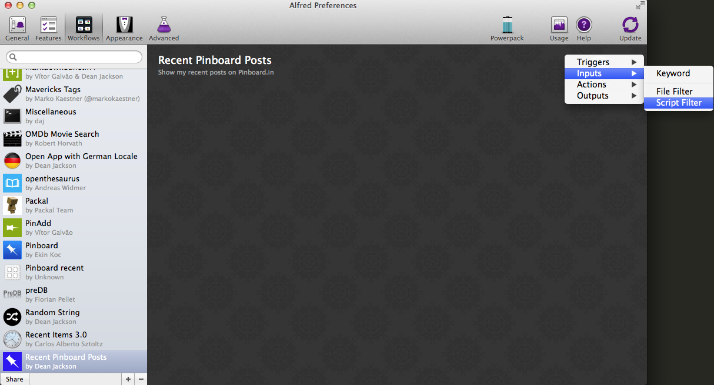
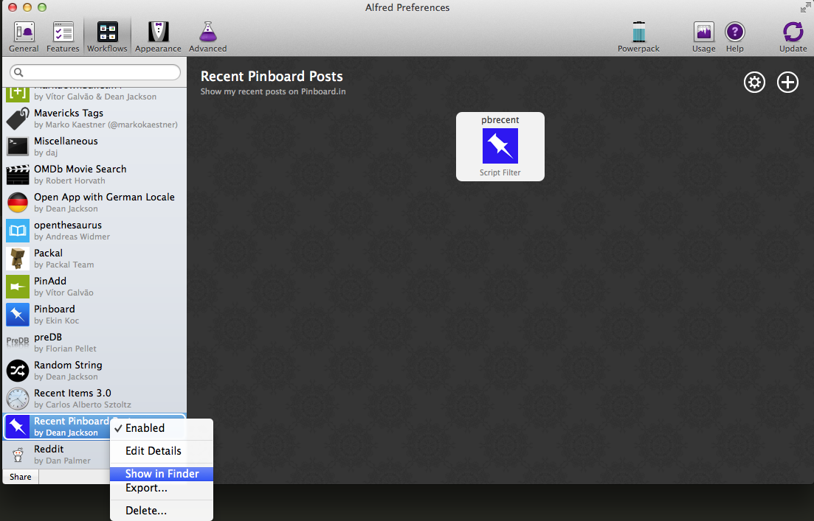
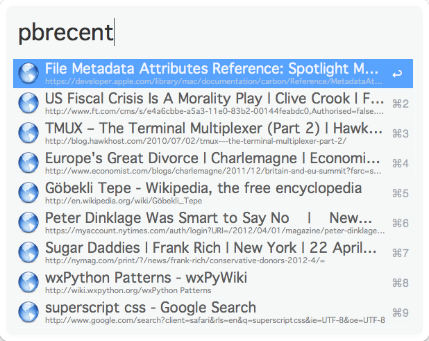
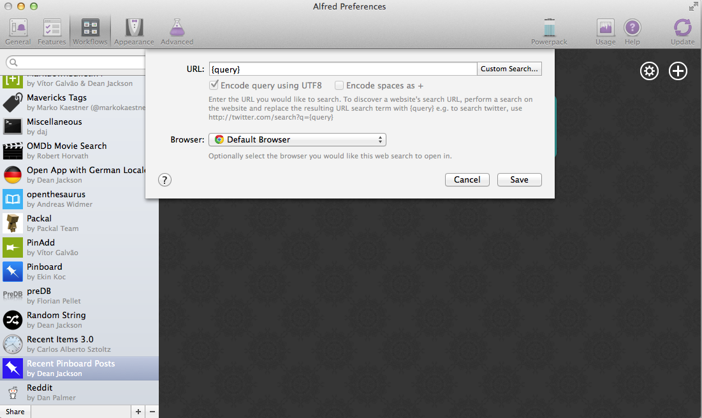
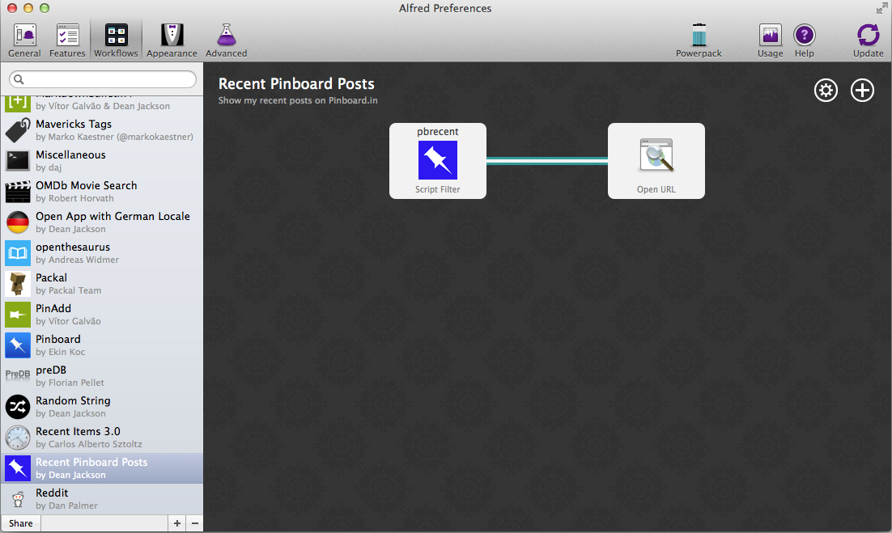
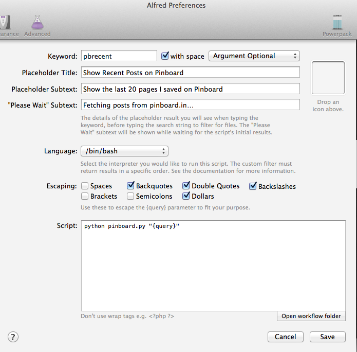

.. _tutorial_1:

===================================================
Tutorial Part 1: Creating a Basic Pinboard Workflow
===================================================

In which we build an Alfred workflow to view recent posts to `Pinboard.in`_.

.. note::

    To use workflows, you must own Alfred's `Powerpack`_.

.. contents::
   :local:

Creating a new Workflow
=======================

First, create a new, blank workflow in Alfred 2's Preferences, under the
**Workflows** tab:

.. image:: _static/screen1_blank_workflow.png

Describing your Workflow
========================

When the info dialog pops up, give your workflow a name, a **Bundle Id**,
and possibly a description.

.. important::

    The **Bundle Id** is essential: it's the unique name used by Alfred and
    Alfred-Workflow internally to identify your workflow. Alfred-Workflow
    won't work without it.

You can also drag an image to the icon field to the left to make your workflow
pretty (Alfred will use this icon to show your workflow actions in its action
list). I grabbed a `free Pinboard icon`_.

.. image:: _static/screen2_workflow_info1.png

Adding a Script Filter
======================

The next step is to add a **Script Filter**. Script Filters receive input from Alfred
(the query entered by the user) and send results back to Alfred. They should run
as quickly as possible because Alfred will try to call the Script Filter for
every character typed into its query box:

And enter the details for this action (the **Escaping** options don't matter at
the moment because our script currently doesn't accept a query):

.. image:: _static/screen5_script_filter_details.png

Choose a **Keyword**, which you will enter in Alfred to activate your workflow.
At the moment, our Script Filter won't take any arguments, so choose
**No Argument**. The **Placeholder Title** and **Subtext** are what Alfred
will show when you type the **Keyword**:

.. image:: _static/screen4_alfred_list.png

The **"Please Wait" Subtext** is what is shown when your workflow is working,
which in our case means fetching data from pinboard.in.

Very importantly, set the **Language** to ``/bin/bash``.
The **Script** field should contain::

	python pinboard.py

We're going to create the ``pinboard.py`` script in a second. The **Escaping**
options don't matter for now because our Script Filter doesn't accept an
argument.

.. note::

    You *can* choose ``/usr/bin/python3`` as the **Language** and paste
    your Python code into the **Script** box, but this isn't the best idea.

    If you do this, you can't run the script from the Terminal (which can be
    helpful when developing/debugging), and you can't as easily use a proper
    code editor, which makes debugging difficult: Python always tells you which
    line an error occurred on, but the **Script** field doesn't show line
    numbers, so lots of counting is involved.

Now Alfred has created the workflow, we can open it up and add our script.
Right-click on your workflow in the list on the left and choose
**Show in Finder**.

The directory will show one or two files (depending on whether or not you
chose an icon):

.. image:: _static/screen7_finder.png

At this point, download `the latest release of Alfred-Workflow`_ from GitHub,
extract it and copy the ``workflow`` directory into your workflow's directory:

.. image:: _static/screen8_finder_with_workflow.png

Now we can start coding.

.. _writing-script:

Writing your Python script
==========================

Using your text editor of choice [#]_, create a new text file and save it in your
workflow directory as ``pinboard.py`` (the name we used when setting up the
Script Filter).

Add the following code to ``pinboard.py`` (be sure to change ``API_KEY`` to
your pinboard API key. You can find it on the `settings/password page`_):

.. code-block:: python
   :linenos:

    # encoding: utf-8

    import sys
    from workflow import Workflow, ICON_WEB, web

    API_KEY = 'your-pinboard-api-key'

    def main(wf):
        url = 'https://api.pinboard.in/v1/posts/recent'
        params = dict(auth_token=API_KEY, count=20, format='json')
        r = web.get(url, params)

        # throw an error if request failed
        # Workflow will catch this and show it to the user
        r.raise_for_status()

        # Parse the JSON returned by pinboard and extract the posts
        result = r.json()
        posts = result['posts']

        # Loop through the returned posts and add an item for each to
        # the list of results for Alfred
        for post in posts:
            wf.add_item(title=post['description'],
                        subtitle=post['href'],
                        icon=ICON_WEB)

        # Send the results to Alfred as XML
        wf.send_feedback()

    if __name__ == u"__main__":
        wf = Workflow()
        sys.exit(wf.run(main))

All being well, our workflow should now work. Fire up Alfred, enter your
keyword and hit **ENTER**. You should see something like this:

If something went wrong (e.g. an incorrect API key, as in the screenshot),
you should see an error like this:

.. image:: _static/screen10_workflow_error.png

If Alfred shows nothing at all, it probably couldn't run your Python script at
all. You'll have to `open the workflow directory in Terminal <https://www.youtube.com/watch?v=xsCCgITrrWI>`_
and run the script by hand to see the error::

	python pinboard.py

Adding workflow actions
=======================

So now we can see a list of recent posts in Alfred, but can't do anything with
them. We're going to change that and make the items "actionable" (i.e. you
can hit **ENTER** on them and something happens, in this case, the page
will be opened in your browser).

Add the highlighted lines (27–28) to your ``pinboard.py`` file:

.. code-block:: python
   :linenos:
   :emphasize-lines: 27,28

    # encoding: utf-8

    import sys
    from workflow import Workflow, ICON_WEB, web

    API_KEY = 'your-pinboard-api-key'

    def main(wf):
        url = 'https://api.pinboard.in/v1/posts/recent'
        params = dict(auth_token=API_KEY, count=20, format='json')
        r = web.get(url, params)

        # throw an error if request failed
        # Workflow will catch this and show it to the user
        r.raise_for_status()

        # Parse the JSON returned by pinboard and extract the posts
        result = r.json()
        posts = result['posts']

        # Loop through the returned posts and add an item for each to
        # the list of results for Alfred
        for post in posts:
            wf.add_item(title=post['description'],
                        subtitle=post['href'],
                        arg=post['href'],
                        valid=True,
                        icon=ICON_WEB)

        # Send the results to Alfred as XML
        wf.send_feedback()

    if __name__ == u"__main__":
        wf = Workflow()
        sys.exit(wf.run(main))

``valid=True`` tells Alfred that the item is actionable and ``arg`` is the
value it will pass to the next action (in this case a URL).

Go back to Alfred's Preferences and add an **Open URL** action:

.. image:: _static/screen11_add_open_url.png

Then enter ``{query}`` as the URL:

When you hover your mouse over the Script Filter, you'll notice a small "nub"
appears on the right-hand side:

.. image:: _static/screen12_5_nub.png

Click and hold on this, and drag a connection to the **Open URL** action:

Now run your workflow again in Alfred, select one of the results and hit
**ENTER**. The post's webpage should open in your default browser.

Improving performance and not getting banned
============================================

The terms of use of the Pinboard API specifically limit calls to the recent
posts method to `1 call/minute <https://pinboard.in/api#limits>`_. As it's
likely you'll call your workflow more often than that, we need to cache the
results from the API and use the cached data for at least a minute.
Alfred-Workflow makes this a doddle with its
:meth:`~workflow.workflow.Workflow.cached_data` method.

Go back to ``pinboard.py`` and make the following changes:

.. code-block:: python
   :linenos:
   :emphasize-lines: 9-26,31-33

    # encoding: utf-8

    import sys
    from workflow import Workflow, ICON_WEB, web

    API_KEY = 'your-pinboard-api-key'

    def get_recent_posts():
        """Retrieve recent posts from Pinboard.in

        Returns a list of post dictionaries.

        """
        url = 'https://api.pinboard.in/v1/posts/recent'
        params = dict(auth_token=API_KEY, count=20, format='json')
        r = web.get(url, params)

        # throw an error if request failed
        # Workflow will catch this and show it to the user
        r.raise_for_status()

        # Parse the JSON returned by pinboard and extract the posts
        result = r.json()
        posts = result['posts']
        return posts

    def main(wf):

        # Retrieve posts from cache if available and no more than 60
        # seconds old
        posts = wf.cached_data('posts', get_recent_posts, max_age=60)

        # Loop through the returned posts and add an item for each to
        # the list of results for Alfred
        for post in posts:
            wf.add_item(title=post['description'],
                        subtitle=post['href'],
                        arg=post['href'],
                        valid=True,
                        icon=ICON_WEB)

        # Send the results to Alfred as XML
        wf.send_feedback()

We've moved the code that retrieves the data from the API to a separate
function (``get_recent_posts()``, line 9) and instead we ask
:meth:`Workflow.cached_data() <workflow.workflow.Workflow.cached_data>` (line 33)
for the data cached under the name ``posts`` (the first argument).
:meth:`~workflow.workflow.Workflow.cached_data` will first check its cache for
data saved under ``posts`` and return those data
if they're less than ``max_age`` seconds old. If the data are older or don't
exist, it will call the ``get_recent_posts()`` function passed as the second
parameter, cache the data returned by that function under the name ``posts``
and return it.

So now we won't get banned by Pinboard for hammering the API, and as a bonus,
the workflow is now *blazingly* fast when the data are in its cache. For this
reason, it's probably a good idea to increase ``max_age`` to 300 or 600 seconds
(5 or 10 minutes) or even more—depending on how often you add new posts
to Pinboard—to get super-fast results more often.

Making the posts searchable
===========================

What if you're looking for a specific post? Who's got time to scroll through
a list of 20 results? Let's make them searchable.

First, update the Script Filter settings. Next to **Keyword**, change
**No Argument** to **Argument Optional** and select **with space**.
**with space** means that when you hit **ENTER** or **TAB** on your workflow
action, Alfred will add a space after it, so you can start typing your query
immediately. Then add ``"{query}"`` in the **Script** text field. ``{query}``
will be replaced by Alfred with whatever you've typed after the keyword. Finally,
set the **Escaping** options to:

- Backquotes
- Double Quotes
- Dollars
- Backslashes

and **nothing** else. This ensures that the query reaches your Python script
unmolested by ``bash``. Your **Script Filter** settings should now look like
this:

First, we'll set the script to get 100 recent posts from Pinboard (the maximum
allowed)  in line 16 and to cache them for 10 minutes in line 33 (or use 300
seconds for 5 minutes if you're a heavy Pinboardista):

.. code-block:: python
   :linenos:
   :emphasize-lines: 16,33

    # encoding: utf-8

    import sys
    from workflow import Workflow, ICON_WEB, web

    API_KEY = 'your-pinboard-api-key'

    def get_recent_posts():
        """Retrieve recent posts from Pinboard.in

        Returns a list of post dictionaries.

        """
        url = 'https://api.pinboard.in/v1/posts/recent'
        params = dict(auth_token=API_KEY, count=100, format='json')
        r = web.get(url, params)

        # throw an error if request failed
        # Workflow will catch this and show it to the user
        r.raise_for_status()

        # Parse the JSON returned by pinboard and extract the posts
        result = r.json()
        posts = result['posts']
        return posts

    def main(wf):

        # Retrieve posts from cache if available and no more than 600
        # seconds old
        posts = wf.cached_data('posts', get_recent_posts, max_age=600)

        # Loop through the returned posts and add an item for each to
        # the list of results for Alfred
        for post in posts:
            wf.add_item(title=post['description'],
                        subtitle=post['href'],
                        arg=post['href'],
                        valid=True,
                        icon=ICON_WEB)

        # Send the results to Alfred as XML
        wf.send_feedback()

    if __name__ == u"__main__":
        wf = Workflow()
        sys.exit(wf.run(main))

Then we need to add the ability to receive the query from Alfred and filter our
posts based on it:

.. code-block:: python
   :linenos:
   :emphasize-lines: 29-35,40-44,50-52

    # encoding: utf-8

    import sys
    from workflow import Workflow, ICON_WEB, web

    API_KEY = 'your-pinboard-api-key'

    def get_recent_posts():
        """Retrieve recent posts from Pinboard.in

        Returns a list of post dictionaries.

        """
        url = 'https://api.pinboard.in/v1/posts/recent'
        params = dict(auth_token=API_KEY, count=100, format='json')
        r = web.get(url, params)

        # throw an error if request failed
        # Workflow will catch this and show it to the user
        r.raise_for_status()

        # Parse the JSON returned by pinboard and extract the posts
        result = r.json()
        posts = result['posts']
        return posts

    def search_key_for_post(post):
        """Generate a string search key for a post"""
        elements = []
        elements.append(post['description'])  # title of post
        elements.append(post['tags'])  # post tags
        elements.append(post['extended'])  # description
        return u' '.join(elements)

    def main(wf):

        # Get query from Alfred
        if len(wf.args):
            query = wf.args[0]
        else:
            query = None

        # Retrieve posts from cache if available and no more than 600
        # seconds old
        posts = wf.cached_data('posts', get_recent_posts, max_age=600)

        # If script was passed a query, use it to filter posts
        if query:
            posts = wf.filter(query, posts, key=search_key_for_post)

        # Loop through the returned posts and add an item for each to
        # the list of results for Alfred
        for post in posts:
            wf.add_item(title=post['description'],
                        subtitle=post['href'],
                        arg=post['href'],
                        valid=True,
                        icon=ICON_WEB)

        # Send the results to Alfred as XML
        wf.send_feedback()

    if __name__ == u"__main__":
        wf = Workflow()
        sys.exit(wf.run(main))

Looking at ``main()`` first, we add a ``query`` variable (lines 40–44).
Because our Script Filter can run with or without an argument, we test to see
if any were passed to the script using via :attr:`~workflow.workflow.Workflow.args`
attribute of :class:`~workflow.workflow.Workflow`, and grab the first one if there were
(this will be the contents of ``{query}`` from the Script Filter).

Using :attr:`~workflow.workflow.Workflow.args` is similar to accessing
``sys.argv[1:]`` directly, but additionally decodes the arguments to Unicode
and normalizes them. It also enables :ref:`magic-arguments`.

After getting all the posts from the cache or Pinboard, we then filter them
using the :meth:`Workflow.filter() <workflow.workflow.Workflow.filter>` method
if there is a ``query`` (lines 51–52).

:meth:`Workflow.filter() <workflow.workflow.Workflow.filter>` implements an
Alfred-like search algorithm (e.g. "am" will match "Activity Monitor" as well
as "I Am Legend"), but it needs a string to search. Therefore, we write the
``search_key_for_post()`` (line 29) function that will build a searchable string
for each post, comprising its title, tags and description (in that order).

.. important::

    In the last line of ``search_key_for_post()``, we join the elements with
    ``u' '`` (a Unicode space), not ``' '`` (a byte-string space). The
    :meth:`web.Response.json() <workflow.web.Response.json>` method returns
    Unicode (as do most Alfred-Workflow methods and functions), and mixing
    Unicode and byte-strings will cause a fatal error if the byte-string
    contains non-ASCII characters. In this particular situation, using a
    byte-string space wouldn't cause any problems (a space is ASCII), but
    avoiding mixing byte-strings and Unicode is a very good habit to get into.

    When coding in Python 2, you have to be aware of which strings are Unicode
    and which are encoded  (byte) strings. Best practice is to use Unicode
    internally and decode all text to Unicode when it arrives in your workflow
    (from the Web, system etc.).

    Alfred-Workflow's APIs use Unicode and it works hard to hide as much of
    the complexity of working with byte-strings and Unicode as possible, but
    you still need to manually decode encoded byte-strings from other sources
    with :meth:`Workflow.decode() <workflow.workflow.Workflow.decode>` to avoid
    fatal encoding errors.

    See :ref:`text-encoding` in the :ref:`user-manual` for more information on
    dealing with encoded (byte) strings and Unicode in workflows.

Improving the search results
----------------------------

If you've been trying out the workflow, you've probably noticed that your queries
match a lot of posts they really shouldn't. The reason for this is that,
by default, :meth:`Workflow.filter() <workflow.workflow.Workflow.filter>` matches
*anything* that contains all the characters of ``query`` in the same order,
regardless of case. To fix this, we'll add a ``min_score`` argument to
:meth:`Workflow.filter() <workflow.workflow.Workflow.filter>`. Change the line:

.. code-block:: python

    posts = wf.filter(query, posts, key=search_key_for_post)

to:

.. code-block:: python

    posts = wf.filter(query, posts, key=search_key_for_post, min_score=20)

and try the workflow again. The junk results should be gone. You can adjust
``min_score`` up or down depending on how strict you want to be with the results.

What now?
=========

So we've got a working workflow, but it's not yet ready to be distributed to
other users (we can't reasonably ask users to edit the code to enter their API
key, especially as they'd have to do it again after updating the workflow to a
new version). We'll turn what we've got into a distribution-ready workflow in
the :ref:`second part of the tutorial <tutorial_2>`.

Further reading
---------------

For more information about writing Alfred workflows, try the following:

- `A good tutorial on Alfred workflows for beginners`_ by `Richard Guay`_
- `The Alfred Forum`_. It's a good place to find workflows and the
  `Workflow Help & Questions forum`_ forum is the best place to get help with
  writing workflows.

To learn more about coding in Python, try these resources:

- `The Python Tutorial`_ is a good place to start learning (more) about Python
  programming.
- `Dive into Python`_ by the dearly departed (from the Web) Mark Pilgrim is
  a wonderful (and free) book.
- `Learn Python the Hard Way`_ isn't as hard as it sounds. It's actually
  rather excellent, in fact.

.. _Pinboard.in: https://pinboard.in/
.. _free Pinboard icon: http://www.iconarchive.com/show/simple-icons-by-danleech/pinboard-icon.html
.. _settings/password page: https://pinboard.in/settings/password
.. _the latest release of Alfred-Workflow: https://github.com/deanishe/alfred-workflow/releases/latest
.. _A good tutorial on Alfred workflows for beginners: http://computers.tutsplus.com/tutorials/alfred-workflows-for-beginners--mac-55446
.. _Richard Guay: http://customct.com/
.. _The Alfred Forum: http://www.alfredforum.com/
.. _Workflow Help & Questions forum: http://www.alfredforum.com/forum/13-workflow-help-questions/
.. _The Python Tutorial: http://docs.python.org/2/tutorial/
.. _Dive into Python: http://www.diveintopython.net/toc/index.html
.. _Learn Python the Hard Way: http://learnpythonthehardway.org/book/
.. _Powerpack: https://buy.alfredapp.com/

.. [#] **Do not** use TextEdit to edit code. By default it uses "smart" quotes,
       which will break code. If you have macOS 10.7 or later,
       `TextMate <https://github.com/textmate/textmate/releases>`_ is an
       excellent and free editor.
       `TextWrangler <http://www.barebones.com/products/textwrangler/>`_ is
       another good, free editor for macOS (supports 10.6).
